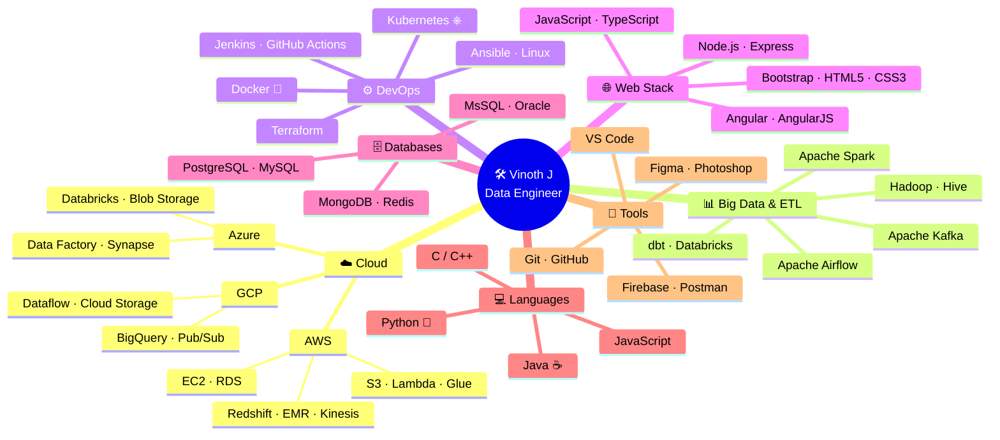
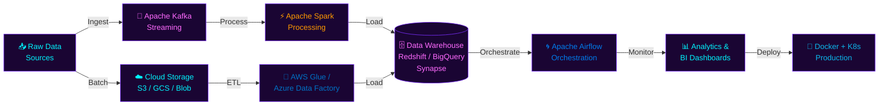

<div align="center">

<!-- ╔══════════════════════════════════════════════════════════════════╗ -->
<!--   ✦  COSMIC HEADER — ANIMATED CAPSULE RENDER  ✦                  -->
<!-- ╚══════════════════════════════════════════════════════════════════╝ -->


<!-- ╔══════════════════════════════════════════════════════════════════╗ -->
<!--   ✦  TYPING SVG — FIXED WORKING URL  ✦                           -->
<!-- ╚══════════════════════════════════════════════════════════════════╝ -->

<br/>

[](https://git.io/typing-svg)

<br/>

<!-- ╔══════════════════════════════════════════════════════════════════╗ -->
<!--   ✦  TROPHIES — FIXED: onedark theme, column=8  ✦                -->
<!-- ╚══════════════════════════════════════════════════════════════════╝ -->


<br/><br/>

<!-- Badges Row -->
<p>
  
  &nbsp;
  
  &nbsp;
  
  &nbsp;
  
</p>

</div>

---


<!-- ╔══════════════════════════════════════════════════════════════════╗ -->
<!--   ✦  ABOUT ME — ULTRA EXPANDED + FANTASY  ✦                      -->
<!-- ╚══════════════════════════════════════════════════════════════════╝ -->

<div align="center">

<h2>

&nbsp;

&nbsp;

</h2>

</div>

<table align="center" border="0" width="96%">
<tr>
<td width="52%" valign="top">

```javascript
// 👨‍💻 Vinoth J — Data Engineer & Cloud Craftsman
const vinoth = {
  name        : "Vinoth J",
  username    : "vinothjv10",
  role        : ["Data Engineer 🔥", "Cloud Architect ☁️",
                 "DevOps Engineer ⚙️", "MEAN Dev 🌐"],
  location    : "India 🇮🇳",
  currentFocus: "AngularJS + Cloud Native 🌿",
  expertise   : ["ETL Pipelines", "Data Warehousing",
                 "Stream Processing", "REST APIs",
                 "CI/CD", "Containerisation"],
  cloud       : ["AWS ☁️", "Azure 🔷", "GCP 🌈"],
  databases   : ["MongoDB", "MsSQL", "Oracle",
                 "PostgreSQL", "Redis"],
  devops      : ["Docker 🐳", "Kubernetes ⎈",
                 "Terraform", "Jenkins", "GitHub Actions"],
  bigData     : ["Apache Spark", "Kafka", "Airflow",
                 "Hadoop", "Hive"],
  contact     : "vinothjv10@gmail.com",
  blog        : "techhubreal.blogspot.com",
  portfolio   : "vinothjv.netlify.app",
  funFact     : "I am funny ✨😂",
  status      : "Always learning, always shipping 🚀",
};
```

</td>
<td width="48%" valign="top">

### 🌟 My Journey at a Glance

🔭 &nbsp;**Building** world-class data pipelines & ETL workflows  
🌱 &nbsp;**Currently mastering** AngularJS + Terraform + Kafka  
☁️ &nbsp;**Cloud adventures** on **AWS · Azure · GCP** daily  
🐳 &nbsp;**Containerising** everything with Docker & Kubernetes  
📊 &nbsp;**Wrangling big data** with Spark, Airflow & Hadoop  
🔥 &nbsp;**Crafting** MEAN stack web apps that scale globally  
✍️ &nbsp;**Writing** tech articles → [techhubreal.blogspot.com](https://techhubreal.blogspot.com/)  
🗂️ &nbsp;**Projects portfolio** → [vinothjv.netlify.app/#](https://vinothjv.netlify.app/#)  
💬 &nbsp;**Ask me about** MEAN · Data Pipelines · Cloud Arch  
📫 &nbsp;**Ping me** → [vinothjv10@gmail.com](mailto:vinothjv10@gmail.com)  
📄 &nbsp;**Experiences** → [Resume Link](#)  
⚡ &nbsp;**Fun fact** → I am funny ✨😂  

---

### 🎯 Currently Levelling Up


</td>
</tr>
</table>

---


<!-- ╔══════════════════════════════════════════════════════════════════╗ -->
<!--   ✦  SKILLS — FULL CLOUD + DEVOPS + DATA  ✦                      -->
<!-- ╚══════════════════════════════════════════════════════════════════╝ -->

<div align="center">

<h2>

&nbsp; My Tech Arsenal &nbsp;

</h2>

<!-- ☁️ CLOUD PLATFORMS -->
<h3>☁️ Cloud Platforms</h3>


**AWS Services:** &nbsp;


**Azure Services:** &nbsp;


**GCP Services:** &nbsp;


---

<!-- ⚙️ DEVOPS -->
<h3>⚙️ DevOps & Infrastructure</h3>


<br/><br/>


---

<!-- 📊 DATA ENGINEERING -->
<h3>📊 Data Engineering & Big Data</h3>


---

<!-- 🎨 FRONTEND -->
<h3>🎨 Frontend</h3>


---

<!-- ⚡ BACKEND & LANGUAGES -->
<h3>⚡ Backend & Languages</h3>


---

<!-- 🗄️ DATABASES -->
<h3>🗄️ Databases</h3>


---

<!-- 🛠️ TOOLS -->
<h3>🛠️ Tools & Design</h3>


</div>

---


<!-- ╔══════════════════════════════════════════════════════════════════╗ -->
<!--   ✦  CONNECT WITH ME  ✦                                          -->
<!-- ╚══════════════════════════════════════════════════════════════════╝ -->

<div align="center">

<h2>

&nbsp; Connect With Me &nbsp;

</h2>

<p>
<a href="https://twitter.com/vinothjv10"></a>&nbsp;
<a href="https://linkedin.com/in/vinothjv10"></a>&nbsp;
<a href="https://fb.com/vinothjv10"></a>&nbsp;
<a href="https://instagram.com/vinothjv10"></a>&nbsp;
<a href="https://www.codechef.com/users/vinothjv10"></a>&nbsp;
<a href="https://www.hackerrank.com/vinothjv10"></a>&nbsp;
<a href="https://t.me/vinothjv10"></a>&nbsp;
<a href="https://techhubreal.blogspot.com/"></a>&nbsp;
<a href="https://vinothjv.netlify.app/#"></a>
</p>

</div>

---


<!-- ╔══════════════════════════════════════════════════════════════════╗ -->
<!--   ✦  DATA ENGINEERING UNIVERSE — MERMAID MIND MAP  ✦             -->
<!-- ╚══════════════════════════════════════════════════════════════════╝ -->

<div align="center">
<h2>🌌 My Data Engineering Universe</h2>
</div>



---


<!-- ╔══════════════════════════════════════════════════════════════════╗ -->
<!--   ✦  DATA PIPELINE FLOW DIAGRAM  ✦                               -->
<!-- ╚══════════════════════════════════════════════════════════════════╝ -->

<div align="center">
<h2>🔄 My Data Pipeline Architecture</h2>
</div>



---


<!-- ╔══════════════════════════════════════════════════════════════════╗ -->
<!--   ✦  GITHUB STATS  ✦                                             -->
<!-- ╚══════════════════════════════════════════════════════════════════╝ -->

<div align="center">

<h2>

&nbsp; GitHub Analytics &nbsp;

</h2>

<p>


</p>


</div>

---


<!-- ╔══════════════════════════════════════════════════════════════════╗ -->
<!--   ✦  CONTRIBUTION GRAPH  ✦                                       -->
<!-- ╚══════════════════════════════════════════════════════════════════╝ -->

<div align="center">

<h2>📈 Contribution Graph</h2>


</div>

---


<!-- ╔══════════════════════════════════════════════════════════════════╗ -->
<!--   ✦  RANDOM DEV QUOTE  ✦                                         -->
<!-- ╚══════════════════════════════════════════════════════════════════╝ -->

<div align="center">

<h2>💡 Dev Quote of the Day</h2>


</div>

---


<!-- ╔══════════════════════════════════════════════════════════════════╗ -->
<!--   ✦  SNAKE ANIMATION  ✦                                          -->
<!-- ╚══════════════════════════════════════════════════════════════════╝ -->

<div align="center">

<h2>🐍 My Contributions Getting Devoured!</h2>

<picture>
  <source media="(prefers-color-scheme: dark)" srcset="https://raw.githubusercontent.com/vinothjv10/vinothjv10/output/github-snake-dark.svg"/>
  <source media="(prefers-color-scheme: light)" srcset="https://raw.githubusercontent.com/vinothjv10/vinothjv10/output/github-snake.svg"/>
  
</picture>

</div>

---


<!-- ╔══════════════════════════════════════════════════════════════════╗ -->
<!--   ✦  FOOTER  ✦                                                   -->
<!-- ╚══════════════════════════════════════════════════════════════════╝ -->

<div align="center">

<br/>


<h3>⚡ "Data is the new oil — and I'm the engineer who refines it." 🚀</h3>

<p>

</p>

<br/>


</div>

<!-- ═══════════════════════════════════════════════════════════════════ -->
<!-- 📌 SNAKE WORKFLOW — Add to .github/workflows/snake.yml            -->
<!--                                                                   -->
<!-- name: Generate Snake                                              -->
<!-- on:                                                               -->
<!--   schedule:                                                       -->
<!--     - cron: "0 */12 * * *"                                        -->
<!--   workflow_dispatch:                                              -->
<!-- jobs:                                                             -->
<!--   build:                                                          -->
<!--     runs-on: ubuntu-latest                                        -->
<!--     steps:                                                        -->
<!--       - uses: Platane/snk/svg-only@v3                             -->
<!--         with:                                                     -->
<!--           github_user_name: ${{ github.repository_owner }}        -->
<!--           outputs: |                                              -->
<!--             dist/github-snake.svg                                 -->
<!--             dist/github-snake-dark.svg?palette=github-dark        -->
<!--       - uses: crazy-max/ghaction-github-pages@v3.1.0              -->
<!--         with:                                                     -->
<!--           target_branch: output                                   -->
<!--           build_dir: dist                                         -->
<!--         env:                                                      -->
<!--           GITHUB_TOKEN: ${{ secrets.GITHUB_TOKEN }}               -->
<!-- ═══════════════════════════════════════════════════════════════════ -->
