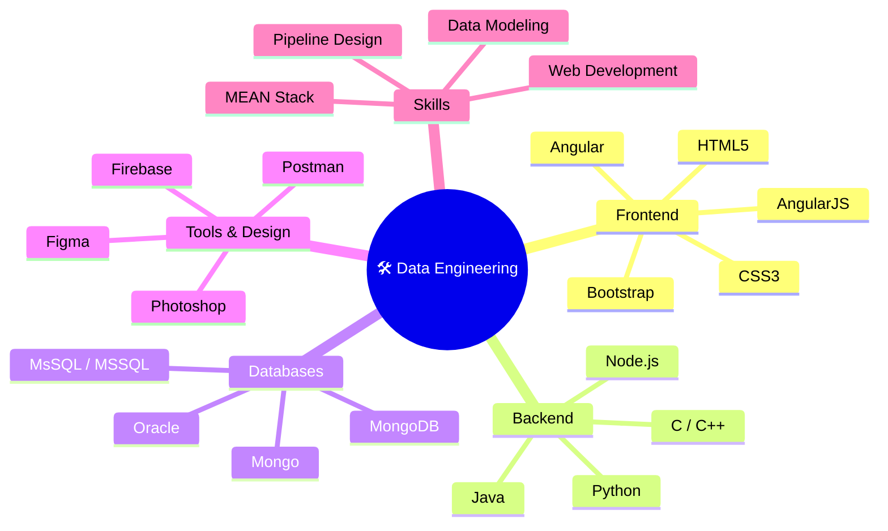

<div align="center">

<!-- ═══════════════════════════════════════════════════ -->
<!--            ANIMATED HEADER BANNER                  -->
<!-- ═══════════════════════════════════════════════════ -->


<!-- ═══════════════════════════════════════════════════ -->
<!--            TYPING ANIMATION                        -->
<!-- ═══════════════════════════════════════════════════ -->

<a href="https://git.io/typing-svg">
  
</a>

<br/>

<!-- Profile Trophy Row -->


<br/>

<!-- Visitor Badge + Follow Badge + Profile Views -->
<p>
  
  &nbsp;
  <a href="https://twitter.com/vinothjv10">
    
  </a>
  &nbsp;
  
</p>

</div>

---

<!-- ═══════════════════════════════════════════════════ -->
<!--          ANIMATED DIVIDER                          -->
<!-- ═══════════════════════════════════════════════════ -->


<!-- ═══════════════════════════════════════════════════ -->
<!--           ABOUT ME SECTION                         -->
<!-- ═══════════════════════════════════════════════════ -->

<div align="center">
<h2>
  
  &nbsp; About Me &nbsp;
  
</h2>
</div>

<table align="center" border="0" cellspacing="0" cellpadding="0">
<tr>
<td width="50%" valign="top">

```yaml
Name        : Vinoth J
Username    : vinothjv10
Role        : Data Engineer
Location    : India 🇮🇳
Learning    : AngularJS 🌿
Expertise   : MEAN Stack & Web Dev
Email       : vinothjv10@gmail.com
Blog        : techhubreal.blogspot.com
Portfolio   : vinothjv.netlify.app
Fun Fact    : I am funny ✨😂
```

</td>
<td width="50%" valign="top">

- 🌱 Currently leveling up with **AngularJS**
- 🗂️ All projects live at **[vinothjv.netlify.app/#](https://vinothjv.netlify.app/#)**
- ✍️ I write articles at **[techhubreal.blogspot.com](https://techhubreal.blogspot.com/)**
- 💬 Ask me anything about **MEAN Stack & Web Dev**
- 📫 Reach me: **[vinothjv10@gmail.com](mailto:vinothjv10@gmail.com)**
- 📄 Know about my experiences: **[Resume Link](#)**
- ⚡ Fun fact: **I am funny ✨**

</td>
</tr>
</table>

---


<!-- ═══════════════════════════════════════════════════ -->
<!--           CONNECT WITH ME                          -->
<!-- ═══════════════════════════════════════════════════ -->

<div align="center">

<h2>
  
  &nbsp; Connect With Me &nbsp;
  
</h2>

<p>
  <a href="https://twitter.com/vinothjv10" target="_blank">
    
  </a>
  &nbsp;
  <a href="https://linkedin.com/in/vinothjv10" target="_blank">
    
  </a>
  &nbsp;
  <a href="https://fb.com/vinothjv10" target="_blank">
    
  </a>
  &nbsp;
  <a href="https://instagram.com/vinothjv10" target="_blank">
    
  </a>
  &nbsp;
  <a href="https://www.codechef.com/users/vinothjv10" target="_blank">
    
  </a>
  &nbsp;
  <a href="https://www.hackerrank.com/vinothjv10" target="_blank">
    
  </a>
  &nbsp;
  <a href="https://t.me/vinothjv10" target="_blank">
    
  </a>
  &nbsp;
  <a href="https://techhubreal.blogspot.com/" target="_blank">
    
  </a>
</p>

</div>

---


<!-- ═══════════════════════════════════════════════════ -->
<!--       LANGUAGES AND TOOLS                          -->
<!-- ═══════════════════════════════════════════════════ -->

<div align="center">

<h2>
  
  &nbsp; Languages & Tools &nbsp;
  
</h2>

<!-- Frontend -->
<h4>🎨 Frontend</h4>
<p>
  
</p>

<!-- Backend -->
<h4>⚙️ Backend & Languages</h4>
<p>
  
</p>

<!-- Databases -->
<h4>🗄️ Databases</h4>
<p>
  
</p>

<!-- Tools & Design -->
<h4>🛠️ Tools & Design</h4>
<p>
  
</p>

</div>

---


<!-- ═══════════════════════════════════════════════════ -->
<!--           DATA ENGINEERING MIND MAP                -->
<!-- ═══════════════════════════════════════════════════ -->

<div align="center">

<h2>🧠 My Data Engineering Universe</h2>



</div>

---


<!-- ═══════════════════════════════════════════════════ -->
<!--           GITHUB STATS SECTION                     -->
<!-- ═══════════════════════════════════════════════════ -->

<div align="center">

<h2>
  
  &nbsp; GitHub Analytics &nbsp;
  
</h2>

<p>
  
  
</p>


</div>

---


<!-- ═══════════════════════════════════════════════════ -->
<!--           ACTIVITY GRAPH                           -->
<!-- ═══════════════════════════════════════════════════ -->

<div align="center">

<h2>📈 Contribution Graph</h2>


</div>

---


<!-- ═══════════════════════════════════════════════════ -->
<!--           WPM / CODING QUOTE                       -->
<!-- ═══════════════════════════════════════════════════ -->

<div align="center">

<h2>💡 Dev Quote of the Day</h2>


</div>

---


<!-- ═══════════════════════════════════════════════════ -->
<!--           SNAKE ANIMATION                          -->
<!-- ═══════════════════════════════════════════════════ -->

<div align="center">

<h2>🐍 Watch My Contributions Get Eaten!</h2>

<picture>
  <source media="(prefers-color-scheme: dark)" srcset="https://raw.githubusercontent.com/vinothjv10/vinothjv10/output/github-snake-dark.svg" />
  <source media="(prefers-color-scheme: light)" srcset="https://raw.githubusercontent.com/vinothjv10/vinothjv10/output/github-snake.svg" />
  
</picture>

</div>

---


<!-- ═══════════════════════════════════════════════════ -->
<!--           FOOTER                                   -->
<!-- ═══════════════════════════════════════════════════ -->

<div align="center">

<h3>⚡ Fun Fact: I am funny ✨😂</h3>


</div>

<!-- ═══════════════════════════════════════════════════ -->
<!--    GITHUB ACTIONS WORKFLOW FOR SNAKE (reference)   -->
<!-- ═══════════════════════════════════════════════════ -->

<!--
📌 TO ENABLE SNAKE ANIMATION:
Create .github/workflows/snake.yml with:

name: Generate Snake
on:
  schedule:
    - cron: "0 */12 * * *"
  workflow_dispatch:
jobs:
  build:
    runs-on: ubuntu-latest
    steps:
      - uses: Platane/snk/svg-only@v3
        with:
          github_user_name: ${{ github.repository_owner }}
          outputs: |
            dist/github-snake.svg
            dist/github-snake-dark.svg?palette=github-dark
      - uses: crazy-max/ghaction-github-pages@v3.1.0
        with:
          target_branch: output
          build_dir: dist
        env:
          GITHUB_TOKEN: ${{ secrets.GITHUB_TOKEN }}
-->
