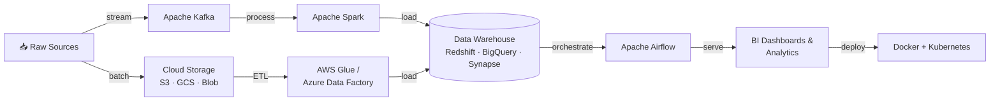

  

  &nbsp;
  &nbsp;
  &nbsp;
  &nbsp;
  

 

---

## 👨‍💻 About Me

I'm a **Data Engineer & Cloud Architect** based in India 🇮🇳, focused on building scalable data pipelines, ETL workflows, and cloud-native infrastructure across AWS, Azure, and GCP. I combine deep big-data expertise with full-stack web development to ship complete, production-ready solutions.

<table>
  <tr><td>🔭 <strong>Currently building</strong></td><td>End-to-end data pipelines &amp; real-time streaming architectures</td></tr>
  <tr><td>🌱 <strong>Levelling up in</strong></td><td>AngularJS &nbsp;·&nbsp; Apache Kafka &nbsp;·&nbsp; Terraform</td></tr>
  <tr><td>🐳 <strong>Daily drivers</strong></td><td>Docker &nbsp;·&nbsp; Kubernetes &nbsp;·&nbsp; CI/CD pipelines</td></tr>
  <tr><td>📊 <strong>Big data toolkit</strong></td><td>Spark &nbsp;·&nbsp; Airflow &nbsp;·&nbsp; Hadoop &nbsp;·&nbsp; dbt &nbsp;·&nbsp; Databricks</td></tr>
  <tr><td>💬 <strong>Ask me about</strong></td><td>Data Engineering &nbsp;·&nbsp; Cloud Architecture &nbsp;·&nbsp; MEAN Stack</td></tr>
  <tr><td>✍️ <strong>Writing at</strong></td><td><a href="https://techhubreal.blogspot.com/">techhubreal.blogspot.com</a></td></tr>
  <tr><td>📫 <strong>Reach me</strong></td><td><a href="mailto:vinothjv10@gmail.com">vinothjv10@gmail.com</a></td></tr>
  <tr><td>⚡ <strong>Fun fact</strong></td><td>I am funny ✨😂</td></tr>
</table>

---

## 🛠️ Tech Stack

### ☁️ Cloud Platforms & Services

| Platform | Services |
|---|---|
| **AWS** | S3 · Lambda · Glue · Redshift · EMR · Kinesis · EC2 · RDS |
| **Azure** | Data Factory · Synapse Analytics · Databricks · Blob Storage |
| **GCP** | BigQuery · Pub/Sub · Dataflow · Cloud Storage |

### 📊 Data Engineering & Big Data

### ⚙️ DevOps & Infrastructure

### 🌐 Web Development

### 🗄️ Databases

### 💻 Languages

### 🎨 Tools & Design

---

## 🔄 Data Pipeline Architecture

```mermaid
flowchart LR
    A[📥 Raw Sources] -->|stream| B[Apache Kafka]
    A -->|batch| C[Cloud Storage\nS3 · GCS · Blob]
    B -->|process| D[Apache Spark]
    C -->|ETL| E[AWS Glue /\nAzure Data Factory]
    D & E -->|load| F[(Data Warehouse\nRedshift · BigQuery · Synapse)]
    F -->|orchestrate| G[Apache Airflow]
    G -->|serve| H[BI Dashboards &\nAnalytics]
    H -->|deploy| I[Docker + Kubernetes]
```

---

## 📊 GitHub Analytics

  
  

  

---

  
    
  <em>"Data is the new oil — and I'm the engineer who refines it." 🚀</em>
    
  

<!-- ──────────────────────────────────────────────────────────────────
     Snake workflow  →  .github/workflows/snake.yml
     ──────────────────────────────────────────────────────────────────
name: Generate Snake

on:
  schedule:
    - cron: "0 */12 * * *"
  workflow_dispatch:

jobs:
  build:
    runs-on: ubuntu-latest
    steps:
      - uses: Platane/snk/svg-only@v3
        with:
          github_user_name: ${{ github.repository_owner }}
          outputs: |
            dist/github-snake.svg
            dist/github-snake-dark.svg?palette=github-dark
      - uses: crazy-max/ghaction-github-pages@v3.1.0
        with:
          target_branch: output
          build_dir: dist
        env:
          GITHUB_TOKEN: ${{ secrets.GITHUB_TOKEN }}
────────────────────────────────────────────────────────────────── -->
